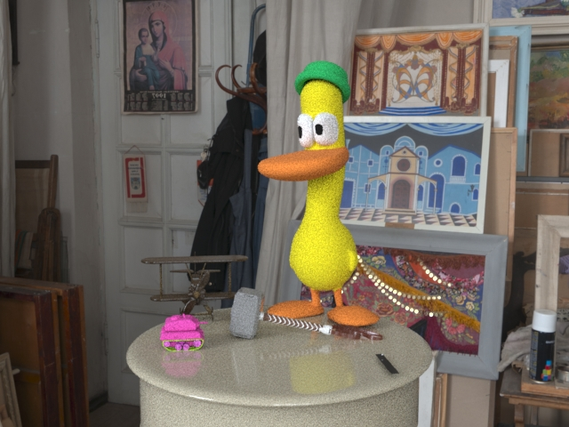
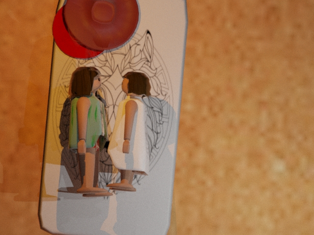
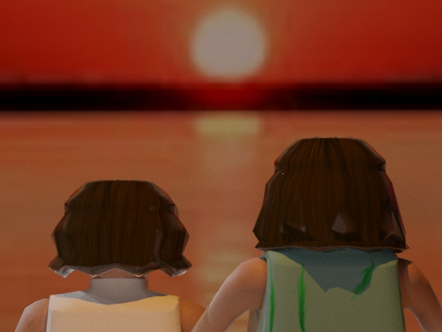
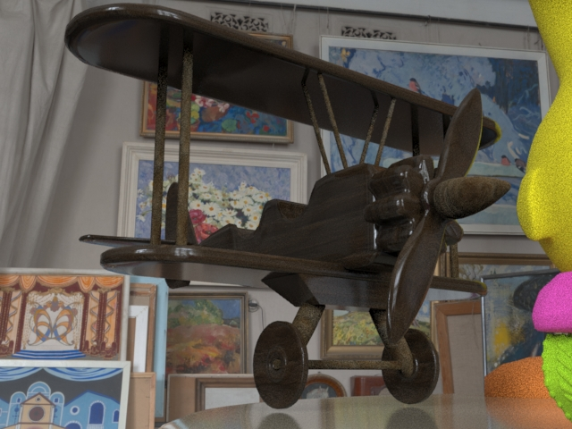
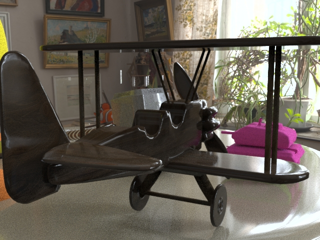
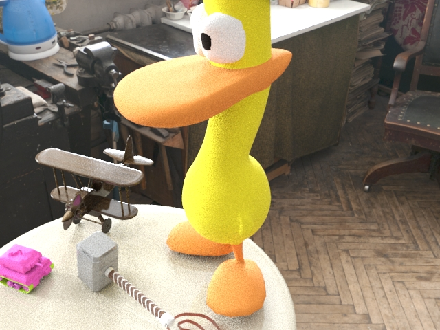

# 🧸 Cartoon Character – 3D Toy Scene  

This project showcases a playful **3D cartoon-style composition** built in **Autodesk 3ds Max**, with additional **texture and material refinement in Adobe Photoshop**.  
The scene combines several toy models — including a duck, a biplane, and stylized characters — arranged in a nostalgic art studio environment to explore **lighting, material balance, and composition storytelling**.

> A vibrant mix of colors, textures, and light — bringing toys to life through 3D visualization. ✨

<br>

<p>
  
  
  
  
</p>


## 🖼️ Preview Gallery  

<div align="center">

<table>
  <tr>
    <td align="center"><strong>🎨 Complete Scene Overview</strong><br></td>
    <td align="center"><strong>🧍‍♂️ Playmobil - Top View</strong><br></td>
  </tr>
  <tr>
    <td align="center"><strong>🌇 Playmobil Sunset Lighting</strong><br></td>
    <td align="center"><strong>✈️ Biplane – Front View</strong><br></td>
  </tr>
  <tr>
    <td align="center"><strong>🛩️ Biplane – Back View</strong><br></td>
    <td align="center"><strong>🔍 Biplane – Top Perspective</strong><br></td>
  </tr>
</table>
<tr>
    <td align="center"><strong>⚙️ Biplane – Bottom Detail</strong><br></td>
  </tr>

</div>

<br>

## 🗂️ Project Structure  

```bash
Cartoon-Character/
├── preview/
│   ├── all_toys_preview.jpg      # Full toy scene overview
│   ├── playmobil.jpg             # Duck / main toy close-up
│   ├── playmobil_sunset.jpg      # Warm lighting version
│   ├── front_view_plane.jpg      # Biplane front angle
│   ├── back_view_plane.jpg       # Biplane back angle
│   ├── top_preview.jpg           # Biplane top view
│   └── bottom_view_plane.jpg     # Biplane underside detail
│
└── README.md                     # Project documentation (this file)
```
## 🧠 Concept & Process

This project was created as a **personal exploration of stylized 3D modeling.**
Each element — from the cartoon duck to the wooden biplane — was modeled and rendered to capture a playful yet realistic atmosphere, inspired by **retro animation and handcrafted toys.**

Key focus areas:

- Experimenting with cartoon proportions and clean topology.

- Balancing realistic light with stylized materials.

- Using Photoshop for post-production and textural enhancement.

- Creating a cozy, nostalgic environment that feels alive through composition.

> The goal was not realism, but emotion through light, color, and texture — a reminder of childhood imagination. 🌟

## 👩‍💻 Author

**Génesis Vaca Palma**

*3D Artist · Web Developer · Data Analyst in progress*

<br>
